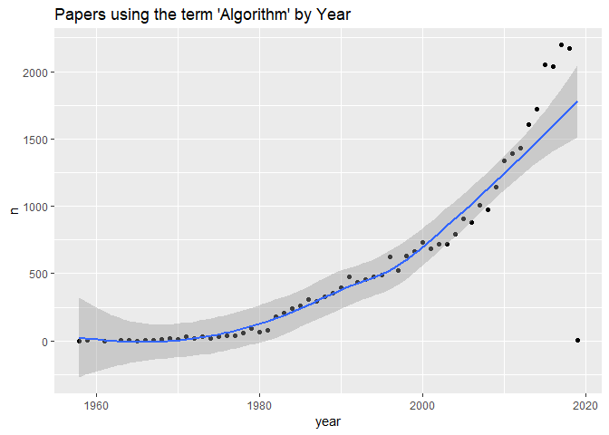

<!-- README.md is generated from README.Rmd. Please edit that file -->

# Evolution of data science, machine learning and artificial intelligence in Petroleum Engineering papers

## README

This is the standalone version of the article that appeared in LinkedIn
at this link
<https://www.linkedin.com/pulse/evolution-data-science-machine-learning-artificial-petroleum-reyes/https://www.linkedin.com/pulse/evolution-data-science-machine-learning-artificial-petroleum-reyes/>,
under the title **Evolution of data science, machine learning and
artificial intelligence in Petroleum Engineering papers**.

This notebook uses primarily the package
[petro.One](https://cran.rstudio.com/web/packages/petro.One/index.html)
that can be installed easily in R or RStudio. The package facilitates
the search of papers by collecting papers in a search in tables or
dataframes that can later be saved as CSV or Excel files.

## Motivation

I have been lately curious about how the terms `data science`, `machine
learning` and `artificial intelligence` evolved over the years in
petroleum engineering papers. It is not that machine learning or data
science are brand new fields of study; quite the contrary, they have
been around for decades, as it has been artificial intelligence.

## Procedure

The current hype is due to (i) the sheer computational power available;
(ii) the availability of fast engines in the cloud; (iii) open source
software such as Python, R, Octave, Hadoop, Spark, Scala, MongoDB,
Javascript, VirtualBox, containerization tools; (iv) an operating system
that runs under all platforms Unix/Linux and different microprocessor
architectures;; (v) the almost-free online education by some of the best
professors in the world; (vi) and the dissemination of knowledge through
the internet (books, papers, articles). It all have commingled at the
right time, at the right places (everywhere).

Initially, I will do the search using the R package
[petro.One](https://cran.rstudio.com/web/packages/petro.One/index.html)
- that I have updated few days ago (thanks, William “Bill” Donovan for
your inquiries)-, while on a quest for finding the right papers given
few keywords on the subject.

I will not give an opinion on what the trends mean for the moment. Let’s
see the numbers to sink in for couple of days. Besides, I might not have
come with all the right keywords for this quick study.

Can you think of keywords relevant to the matter in discussion?

I will start with the broad terms of the moment: `artificial
intelligence`, `machine learning` and `data science`. From there, we
could try some combinations, precursors and derivatives of the terms,
and we’ll see what is the trend.

The number of papers is on **y-axis**, the year on the **x-axis**. I am
using a [Rmarkdown](https://rmarkdown.rstudio.com/) notebook for this
article; [R version 3.5.2](https://cloud.r-project.org/) and
[RStudio 1.2.1226](https://www.rstudio.com/products/rstudio/download/preview/).
To get the data, I am interrogating the
[OnePetro](https://www.onepetro.org/) website. The R package I wrote,
petro.One, simplifies the search by extracting the papers in multiples
of one thousand (the maximum allowed by OnePetro), and creates the
corresponding datasets in the shape of tables. You can take a look at
the petro.One website [here](https://github.com/f0nzie/petro.One).

## Artificial Intelligence

  - First, what year do you see mentions of the keyword -the whole term
    “artificial intelligence” (we are not looking for separate words),
    or starts being used in petroleum engineering papers?

  - When do we see a fast increment on papers with mentions of
    `artificial intelligence`?

  - Do we see a peak?

  - Is the trend ascendant or descendant?

<!-- end list -->

``` r
# artificial intelligence
library(petro.One)
library(dplyr)
library(ggplot2)

# provide two different set of keywords to combine as vectors
major   <- c("artificial intelligence")

results_ai <- run_papers_search(major, 
                             get_papers = TRUE,       # return with papers
                             verbose = FALSE,         # show progress
                             len_keywords = 4,        # naming the data file
                             allow_duplicates = FALSE) # by paper title and id
#> 
#> NULL

(papers_ai <- results_ai$papers)
#> # A tibble: 2,786 x 7
#>    book_title       paper_id   dc_type  authors        year source keyword 
#>    <fct>            <fct>      <fct>    <chr>         <int> <fct>  <chr>   
#>  1 Artificial Inte~ SPE-19282~ confere~ Hojageldiyev~  2018 SPE    'artifi~
#>  2 Production Moni~ SPE-14959~ confere~ Olivares Vel~  2012 SPE    'artifi~
#>  3 Multilateral We~ SPE-18350~ confere~ Al-Mashhad, ~  2016 SPE    'artifi~
#>  4 Multilateral We~ SPE-18368~ confere~ Buhulaigah, ~  2017 SPE    'artifi~
#>  5 Artificial Inte~ SPE-19155~ confere~ Gupta, Supri~  2018 SPE    'artifi~
#>  6 Profiling Downh~ SPE-17342~ confere~ AlAjmi, Moha~  2015 SPE    'artifi~
#>  7 Artificial Inte~ SPE-16950~ confere~ Shahkarami, ~  2014 SPE    'artifi~
#>  8 Forecasting Inc~ ASSE-07-1~ confere~ Al-Mutairi, ~  2007 ASSE   'artifi~
#>  9 Formation Dip D~ SPWLA-198~ journal~ Kerzner, Mar~  1983 SPWLA  'artifi~
#> 10 Estimating Dewp~ SPE-16091~ confere~ Alarfaj, Mal~  2012 SPE    'artifi~
#> # ... with 2,776 more rows

# write to CSV file
out_dir <- "./inst/rawdata"
write.csv(papers_ai, file = file.path(out_dir, "papers_ai.csv"), 
          row.names = FALSE)

# plot on AI by year of publication
papers_ai %>% 
    group_by(year) %>% 
    na.omit() %>% 
    summarize(n = n()) %>% 
    {. ->> papers_ai_by} %>% 
    ggplot(., aes(x = year, y = n)) +
    geom_point() +
    geom_smooth(method = "loess") +
    labs(title = "'Artificial Intelligence' papers by Year")
```


### Computational Intelligence

`Computational Intelligence` is another term that have seen frequently
used by scholars instead of artificial intelligence. Some of them think
that there is no artificial intelligence but that originated from
computers. Makes sense. Unless we are talking of biological duplication
of human intelligence. You will see the term computational intelligence
in books and papers outside petroleum engineering.

``` r
# computational intelligence
library(petro.One)
library(dplyr)
library(ggplot2)

# provide two different set of keywords to combine as vectors
major   <- c("computational intelligence")

results_ci <- run_papers_search(major, 
                             get_papers = TRUE,       # return with papers
                             verbose = FALSE,         # show progress
                             len_keywords = 4,        # naming the data file
                             allow_duplicates = FALSE) # by paper title and id
#> 
#> NULL

(papers_ci <- results_ci$papers)
#> # A tibble: 222 x 7
#>    book_title        paper_id  dc_type authors        year source keyword  
#>    <fct>             <fct>     <fct>   <chr>         <int> <fct>  <chr>    
#>  1 Advances in Hybr~ SPE-1609~ confer~ Anifowose, F~  2012 SPE    'computa~
#>  2 Prediction of Po~ SPE-1266~ confer~ Anifowose, F~  2010 SPE    'computa~
#>  3 Ensemble Machine~ SPE-1681~ confer~ Anifowose, F~  2013 SPE    'computa~
#>  4 Missing Wind Spe~ ISOPE-I-~ confer~ Panapakidis,~  2016 ISOPE  'computa~
#>  5 Prediction of °A~ SPE-1843~ journa~ Goel, Purva,~  2017 SPE    'computa~
#>  6 An Automated Flo~ SPE-1921~ confer~ Tariq, Zeesh~  2018 SPE    'computa~
#>  7 Utilizing State ~ SPE-1923~ confer~ Khan, Mohamm~  2018 SPE    'computa~
#>  8 Maximizing Oil R~ SPE-1956~ confer~ Khan, Mohamm~  2018 SPE    'computa~
#>  9 Fracture Optimiz~ SPE-3734~ confer~ Mohaghegh, S~  1996 SPE    'computa~
#> 10 A Multidisciplin~ SPE-4999~ confer~ Chen, L., RI~  1998 SPE    'computa~
#> # ... with 212 more rows
out_dir <- "./inst/rawdata"
write.csv(papers_ci, file = file.path(out_dir, "papers_ci.csv"), 
          row.names = FALSE)                               # write to CSV file

# plot on CI by year of publication
papers_ci %>% 
    group_by(year) %>% 
    na.omit() %>% 
    summarize(n = n()) %>% 
    {. ->> papers_ci_by} %>% 
    ggplot(., aes(x = year, y = n)) +
    geom_point() +
    geom_smooth(method = "loess") +
    labs(title = "Computational Intelligence papers by Year")
```


### Intelligence

We humans have been very passionate about bringing about certains forms
of intelligence. From ancient times we were just looking to replace
humans in certain repetitive tasks. We could safely says that the
endeavor is 3000 years old. Plato and Aristoteles are mentioned in
literature on the origins of AI, but really goes further back in time if
we investigate other civilizations.

``` r
# intelligence
library(petro.One)
library(dplyr)
library(ggplot2)

# provide two different set of keywords to combine as vectors
major   <- c("intelligence", "intelligent")

results_ii <- run_papers_search(major, 
                             get_papers = TRUE,       # return with papers
                             verbose = FALSE,         # show progress
                             len_keywords = 4,        # naming the data file
                             allow_duplicates = FALSE) # by paper title and id
#> 
#> NULL

(papers_ii <- results_ii$papers)
#> # A tibble: 12,193 x 7
#>    book_title        paper_id  dc_type  authors         year source keyword
#>    <fct>             <fct>     <fct>    <chr>          <int> <fct>  <chr>  
#>  1 Video:          ~ OTC-2516~ present~ Stalford, Har~  2014 OTC    'intel~
#>  2 Intelligent Casi~ OTC-2516~ confere~ Stalford, Har~  2014 OTC    'intel~
#>  3 Networking Intel~ SPE-1001~ journal~ Denney, Denni~  2001 SPE    'intel~
#>  4 Intelligently Us~ SPE-0408~ journal~ Schorn, Patri~  2008 SPE    'intel~
#>  5 Intelligent Pipe~ NACE-072~ confere~ Gu, P., CANME~  2007 NACE   'intel~
#>  6 Intelligent Stra~ SPE-1121~ confere~ Rangnow, Darr~  2008 SPE    'intel~
#>  7 Intelligent Sand~ SPE-9881~ confere~ Oyeneyin, M. ~  2005 SPE    'intel~
#>  8 ESPs and Intelli~ SPE-7765~ confere~ Konopczynski,~  2002 SPE    'intel~
#>  9 Intelligent-Dril~ SPE-0505~ journal~ Bybee, Karen,~  2005 SPE    'intel~
#> 10 Intelligent Well~ SPE-8099~ journal~ Robinson, Mik~  2003 SPE    'intel~
#> # ... with 12,183 more rows
out_dir <- "./inst/rawdata"
write.csv(papers_ii, file = file.path(out_dir, "papers_ii.csv"), 
          row.names = FALSE)                               # write to CSV file

# plot on II by year of publication
papers_ii %>% 
    group_by(year) %>% 
    na.omit() %>% 
    summarize(n = n()) %>% 
    {. ->> papers_ii_by} %>% 
    ggplot(., aes(x = year, y = n)) +
    geom_point() +
    geom_smooth(method = "loess") +
    labs(title = "On `Intelligence` papers by Year")
```


## Machine Learning

`Machine Learning` is a term of more recent origin. We can tell just by
looking at `linear`regression\` as one of the most used or common
machine learning algorithm, notwithstanding that liner regression has
been around hundreds of years.

So the joke goes:

> if you can run a linear regression then you are doing machine
> learning. Therefore, you are in the artificial intelligence business.

:) You know that something is not right\!

``` r
# machine learning
library(petro.One)
library(dplyr)
library(ggplot2)

# provide two different set of keywords to combine as vectors
major   <- c("machine learning")

results_ml <- run_papers_search(major, 
                             get_papers = TRUE,       # return with papers
                             verbose = FALSE,         # show progress
                             len_keywords = 4,        # naming the data file
                             allow_duplicates = FALSE) # by paper title and id
#> 
#> NULL

(papers_ml <- results_ml$papers)
#> # A tibble: 1,677 x 7
#>    book_title       paper_id  dc_type  authors         year source keyword 
#>    <fct>            <fct>     <fct>    <chr>          <int> <fct>  <chr>   
#>  1 Mooring Integri~ OTC-2786~ confere~ Prislin, Igor~  2017 OTC    'machin~
#>  2 Machine learnin~ SEG-2017~ confere~ Smith, Kennet~  2017 SEG    'machin~
#>  3 Machine-learnin~ SEG-2018~ confere~ Maniar, Hiren~  2018 SEG    'machin~
#>  4 Shale Discrimin~ ARMA-201~ confere~ Hoeink, T., B~  2017 ARMA   'machin~
#>  5 Machine Learnin~ OTC-2863~ confere~ Pollock, Jaco~  2018 OTC    'machin~
#>  6 Predicting ESP ~ URTEC-26~ confere~ Sneed, Jessam~  2017 URTEC  'machin~
#>  7 Using Machine L~ OTC-2858~ confere~ Snøtun, Håkon~  2018 OTC    'machin~
#>  8 Seismic trace e~ SEG-2018~ confere~ Shen, Yang, U~  2018 SEG    'machin~
#>  9 Machine Learnin~ SPE-0718~ journal~ Parshall, Joe~  2018 SPE    'machin~
#> 10 Data Driven Pro~ SPE-1809~ confere~ Cao, Q., Schl~  2016 SPE    'machin~
#> # ... with 1,667 more rows
out_dir <- "./inst/rawdata"
write.csv(papers_ml, file = file.path(out_dir, "papers_ml.csv"), 
          row.names = FALSE)                               # write to CSV file

# plot on ML by year of publication
papers_ml %>% 
    group_by(year) %>% 
    na.omit() %>% 
    summarize(n = n()) %>% 
    {. ->> papers_ml_by} %>% 
    ggplot(., aes(x = year, y = n)) +
    geom_point() +
    geom_smooth(method = "loess") +
    labs(title = "Papers on 'Machine Learning' by Year")
```


### Algorithm

This is another keyword of common use these days. Machine Learning is
about algorithms.

``` r
# algorithm
library(petro.One)
library(dplyr)
library(ggplot2)

# provide two different set of keywords to combine as vectors
major   <- c("algorithm")

results_algo <- run_papers_search(major, 
                             get_papers = TRUE,       # return with papers
                             verbose = FALSE,         # show progress
                             len_keywords = 4,        # naming the data file
                             allow_duplicates = FALSE) # by paper title and id
#> 
#> NULL

(papers_algo <- results_algo$papers)
#> # A tibble: 32,406 x 7
#>    book_title        paper_id  dc_type  authors         year source keyword
#>    <fct>             <fct>     <fct>    <chr>          <int> <fct>  <chr>  
#>  1 A Hybrid Refract~ SEG-1988~ confere~ Diggins, Chuc~  1988 SEG    'algor~
#>  2 Fast Ray-tracing~ SEG-1990~ confere~ Zhao, Gaishan~  1990 SEG    'algor~
#>  3 A New Seismic Co~ SEG-2012~ confere~ Chuai, Xiaoyu~  2012 SEG    'algor~
#>  4 Parallel Nested ~ SPE-2524~ confere~ Maksimov, M.M~  1993 SPE    'algor~
#>  5 Robust Internal ~ SEG-2011~ confere~ Wu, Zhiming J~  2011 SEG    'algor~
#>  6 Fast 3-D Inversi~ SEG-1997~ confere~ Singer, Bensi~  1997 SEG    'algor~
#>  7 Design Applicati~ SPE-2636~ confere~ Jefferys, E.R~  1993 SPE    'algor~
#>  8 3D Migration Vel~ SEG-1997~ confere~ Perrot, Julie~  1997 SEG    'algor~
#>  9 Higher-order Sta~ SEG-2003~ confere~ Lu, Wenkai, T~  2003 SEG    'algor~
#> 10 Seismic-acoustic~ SEG-2010~ confere~ Aldridge, Dav~  2010 SEG    'algor~
#> # ... with 32,396 more rows
out_dir <- "./inst/rawdata"
write.csv(papers_algo, file = file.path(out_dir, "papers_algo.csv"), 
          row.names = FALSE)                               # write to CSV file

# plot on algos by year of publication
papers_algo %>% 
    group_by(year) %>% 
    na.omit() %>% 
    summarize(n = n()) %>% 
    {. ->> papers_algo_by} %>% 
    ggplot(., aes(x = year, y = n)) +
    geom_point() +
    geom_smooth(method = "loess") +
    labs(title = "Papers using the term 'Algorithm' by Year")
```



``` r
# predictive analytics
library(petro.One)
library(dplyr)
library(ggplot2)

# provide two different set of keywords to combine as vectors
major   <- c("predictive analytics")

results_pa <- run_papers_search(major, 
                             get_papers = TRUE,       # return with papers
                             verbose = FALSE,         # show progress
                             len_keywords = 4,        # naming the data file
                             allow_duplicates = FALSE) # by paper title and id
#> 
#> NULL

(papers_pa <- results_pa$papers)
#> # A tibble: 520 x 7
#>    book_title        paper_id  dc_type  authors        year source keyword 
#>    <fct>             <fct>     <fct>    <chr>         <int> <fct>  <chr>   
#>  1 Introducing Pred~ SPE-1068~ confere~ Stone, Paul,~  2007 SPE    'predic~
#>  2 Machinery Predic~ SPE-1285~ confere~ Rawi, Zaid, ~  2010 SPE    'predic~
#>  3 The Next Game Ch~ ASSE-15-~ confere~ Lisk, Del, L~  2015 ASSE   'predic~
#>  4 Predictive Analy~ SPE-1287~ confere~ Snyder, Tim,~  2010 SPE    'predic~
#>  5 Predictive Analy~ SPE-1534~ confere~ Holdaway, Ke~  2012 SPE    'predic~
#>  6 Predictive Analy~ NACE-201~ confere~ Crompton, An~  2014 NACE   'predic~
#>  7 Data Mining and ~ SPE-1637~ confere~ Bailey, Rich~  2013 SPE    'predic~
#>  8 Enhancing Wellwo~ SPE-1678~ confere~ Sidahmed, Mo~  2014 SPE    'predic~
#>  9 ESP Health Monit~ SPE-1810~ confere~ Gupta, Supri~  2016 SPE    'predic~
#> 10 Enhancing Well-W~ SPE-1015~ journal~ Wilson, Adam~  2015 SPE    'predic~
#> # ... with 510 more rows
out_dir <- "./inst/rawdata"
write.csv(papers_pa, file = file.path(out_dir, "papers_pa.csv"), 
          row.names = FALSE)                               # write to CSV file

# plot on algos by year of publication
papers_pa %>% 
    group_by(year) %>% 
    na.omit() %>% 
    summarize(n = n()) %>% 
    {. ->> papers_pa_by} %>% 
    ggplot(., aes(x = year, y = n)) +
    geom_point() +
    geom_smooth(method = "loess") +
    labs(title = "Papers using the term 'Predictive Analytics' by Year")
```


``` r
# statistical model
library(petro.One)
library(dplyr)
library(ggplot2)

# provide two different set of keywords to combine as vectors
major   <- c("statistical model")

results_sm <- run_papers_search(major, 
                             get_papers = TRUE,       # return with papers
                             verbose = FALSE,         # show progress
                             len_keywords = 4,        # naming the data file
                             allow_duplicates = FALSE) # by paper title and id
#> 
#> NULL

(papers_sm <- results_sm$papers)
#> # A tibble: 853 x 7
#>    book_title        paper_id   dc_type authors        year source keyword 
#>    <fct>             <fct>      <fct>   <chr>         <int> <fct>  <chr>   
#>  1 Evaluating Resou~ SPE-10743~ confer~ Hall, Russel~  2007 SPE    'statis~
#>  2 Statistical mode~ ARMA-92-0~ confer~ Blair, Steph~  1992 ARMA   'statis~
#>  3 Statistical Mode~ SPE-11334~ journa~ Ghazanfari, ~  2010 SPE    'statis~
#>  4 A Statistical Mo~ ISRM-5CON~ confer~ Weber, Ph., ~  1983 ISRM   'statis~
#>  5 Statistical Mode~ SPE-11334~ confer~ Ghazanfari, ~  2008 SPE    'statis~
#>  6 Developments in ~ SPE-89137~ journa~ Woodhouse, R~  2005 SPE    'statis~
#>  7 Landslide Suscep~ ISRM-VIET~ confer~ Nguyen, Quoc~  2015 ISRM   'statis~
#>  8 Generalized Stat~ SPE-14528~ general Jenkins, D.C~  1985 SPE    'statis~
#>  9 A Statistical Mo~ PETSOC-89~ journa~ Papst, W., G~  1989 PETSOC 'statis~
#> 10 Improved Uncerta~ SPE-14519~ journa~ Sætrom, Jon,~  2012 SPE    'statis~
#> # ... with 843 more rows
out_dir <- "./inst/rawdata"
write.csv(papers_sm, file = file.path(out_dir, "papers_sm.csv"), 
          row.names = FALSE)                               # write to CSV file

# plot on algos by year of publication
papers_sm %>% 
    group_by(year) %>% 
    na.omit() %>% 
    summarize(n = n()) %>% 
    {. ->> papers_sm_by} %>% 
    ggplot(., aes(x = year, y = n)) +
    geom_point() +
    geom_smooth(method = "loess") +
    labs(title = "Papers using the term 'Predictive Analytics' by Year")
```


## Data Science

This is where the fun starts. No machine learning or artificial
intelligence effort is possible without the application of data science.
No dataset, no ML. No ML algorithm, no AI. Pretty simple.

``` r
# data science
library(petro.One)
library(dplyr)
library(ggplot2)

# provide two different set of keywords to combine as vectors
major   <- c("data science")

results_ds <- run_papers_search(major, 
                             get_papers = TRUE,       # return with papers
                             verbose = FALSE,         # show progress
                             len_keywords = 4,        # naming the data file
                             allow_duplicates = FALSE) # by paper title and id
#> 
#> NULL

(papers_ds <- results_ds$papers)
#> # A tibble: 178 x 7
#>    book_title        paper_id  dc_type  authors         year source keyword
#>    <fct>             <fct>     <fct>    <chr>          <int> <fct>  <chr>  
#>  1 Applying Subsurf~ SPE-1898~ confere~ Silva, J., An~  2018 SPE    'data+~
#>  2 Video:          ~ OTC-2863~ present~ Pankaj, Piyus~  2018 OTC    'data+~
#>  3 Application of D~ OTC-2863~ confere~ Pankaj, Piyus~  2018 OTC    'data+~
#>  4 Video:          ~ SPE-1914~ present~ Wen, Tailai, ~  2018 SPE    'data+~
#>  5 An Integrated Pl~ SPE-1914~ confere~ Wen, Tailai, ~  2018 SPE    'data+~
#>  6 Data Drilling: C~ SPE-1734~ confere~ Caldwell, Bri~  2015 SPE    'data+~
#>  7 Time To Enlist i~ SPE-0618~ journal~ Rassenfoss, S~  2018 SPE    'data+~
#>  8 Utilizing a Data~ SPE-1914~ confere~ Olaoye, Olubi~  2018 SPE    'data+~
#>  9 Detecting Failur~ SPE-1900~ confere~ Pennel, Mike,~  2018 SPE    'data+~
#> 10 Technology Focus~ SPE-0218~ journal~ Lee, Heejae, ~  2018 SPE    'data+~
#> # ... with 168 more rows
out_dir <- "./inst/rawdata"
write.csv(papers_ds, file = file.path(out_dir, "papers_ds.csv"), 
          row.names = FALSE)                               # write to CSV file

# plot on DS by year of publication
papers_ds %>% 
    group_by(year) %>% 
    na.omit() %>% 
    summarize(n = n()) %>% 
    {. ->> papers_ds_by} %>% 
    ggplot(., aes(x = year, y = n)) +
    geom_point() +
    geom_smooth(method = "loess") +
    labs(title = "Papers on Data Science by Year")
```


### Precursors, derivatives of “data science”

Data Science is a relatively new term; there are other that have been
widely used in SPE papers, such “data driven”, “data-driven”,
“data-driven analytics”, “data analysis”, etc.

The `data-driven` terms has been profusely present in petroleum
engineering papers.

``` r
# data driven
library(petro.One)
library(dplyr)
library(ggplot2)

# provide two different set of keywords to combine as vectors
major   <- c("data driven", "data-driven")

results_dd <- run_papers_search(major, 
                             get_papers = TRUE,       # return with papers
                             verbose = TRUE,         # show progress
                             len_keywords = 4,        # naming the data file
                             allow_duplicates = FALSE) # by paper title and id
#> 
#>   1  2205 'data+driven'                                                
#>   2  2205 'data-driven'                                                
#> NULL

(papers_dd <- results_dd$papers)
#> # A tibble: 2,206 x 7
#>    book_title        paper_id  dc_type  authors         year source keyword
#>    <fct>             <fct>     <fct>    <chr>          <int> <fct>  <chr>  
#>  1 Geology-constrai~ SEG-2017~ confere~ Espinoza, Car~  2017 SEG    'data-~
#>  2 Inversion Based ~ SEG-2014~ confere~ Wang, Benfeng~  2014 SEG    'data-~
#>  3 Data Driven Prod~ SPE-1809~ confere~ Cao, Q., Schl~  2016 SPE    'data-~
#>  4 SUPPLEMENTARY/SP~ SPE-1826~ media    ""                NA <NA>   'data-~
#>  5 SUPPLEMENTARY/SP~ SPE-1770~ media    ""                NA <NA>   'data-~
#>  6 Video:          ~ SPE-1914~ present~ Ogunbanwo, Ol~  2018 SPE    'data-~
#>  7 On the Accuracy ~ SEG-2011~ confere~ Shaw, Simon A~  2011 SEG    'data-~
#>  8 Data-driven Adap~ SEG-2003~ confere~ Muijs, Remco,~  2003 SEG    'data-~
#>  9 Injection Leakag~ SPE-1693~ confere~ Moreno, G. A.~  2014 SPE    'data-~
#> 10 Predictive Analy~ SPE-1534~ confere~ Holdaway, Kei~  2012 SPE    'data-~
#> # ... with 2,196 more rows
out_dir <- "./inst/rawdata"
write.csv(papers_dd, file = file.path(out_dir, "papers_dd.csv"), 
          row.names = FALSE)                               # write to CSV file

# plot on DD by year of publication
papers_dd %>% 
    group_by(year) %>% 
    na.omit() %>% 
    summarize(n = n()) %>% 
    {. ->> papers_dd_by} %>% 
    ggplot(., aes(x = year, y = n)) +
    geom_point() +
    geom_smooth(method = "loess") +
    labs(title = "Papers on Data Driven by Year")
```


### Analytics

`Analytics` is one of the preffered terms in the media, press, and also
in some paper studies. Sounds kind of nice and “sciency”.

``` r
# analytics
library(petro.One)
library(dplyr)
library(ggplot2)

# provide two different set of keywords to combine as vectors
major   <- c("analytics")

results_an <- run_papers_search(major, 
                             get_papers = TRUE,       # return with papers
                             verbose = TRUE,         # show progress
                             len_keywords = 4,        # naming the data file
                             allow_duplicates = FALSE) # by paper title and id
#> 
#>   1 15807 'analytics'                                                  
#> NULL

(papers_an <- results_an$papers)
#> # A tibble: 15,806 x 7
#>    book_title      paper_id   dc_type  authors          year source keyword
#>    <fct>           <fct>      <fct>    <chr>           <int> <fct>  <chr>  
#>  1 Introducing Pr~ SPE-10686~ confere~ Stone, Paul, BP  2007 SPE    'analy~
#>  2 Machinery Pred~ SPE-12855~ confere~ Rawi, Zaid, BP   2010 SPE    'analy~
#>  3 SUPPLEMENTARY/~ SPE-17343~ media    ""                 NA <NA>   'analy~
#>  4 Analytics Beyo~ SPE-16371~ confere~ Sandlin, Jesse~  2013 SPE    'analy~
#>  5 Analytics Appl~ SPE-17343~ confere~ Anders, Joe, B~  2015 SPE    'analy~
#>  6 Improved Steam~ SPE-97870~ journal~ Chandra, Suand~  2007 SPE    'analy~
#>  7 Improved Steam~ SPE-97870~ confere~ Chandra, Suand~  2005 SPE    'analy~
#>  8 Technology Foc~ SPE-1016-~ journal~ Saputelli, Lui~  2016 SPE    'analy~
#>  9 Analytical Hyd~ WPC-4506   confere~ Lipkin, M. R.,~  1951 WPC    'analy~
#> 10 Time To Enlist~ SPE-0618-~ journal~ Rassenfoss, St~  2018 SPE    'analy~
#> # ... with 15,796 more rows
out_dir <- "./inst/rawdata"
write.csv(papers_an, file = file.path(out_dir, "papers_an.csv"), 
          row.names = FALSE)                               # write to CSV file

# plot on 'analytics' by year of publication
papers_an %>% 
    group_by(year) %>% 
    na.omit() %>% 
    summarize(n = n()) %>% 
    {. ->> papers_an_by} %>% 
    ggplot(., aes(x = year, y = n)) +
    geom_point() +
    geom_smooth(method = "loess") +
    labs(title = "Papers on 'Analytics' by Year")
```


## Data Analytics

`Data Analytics` is another term that is used as an equivalent of `data
science`. They may not have the same meaning for different authors or
companies, but let’s assume for the moment they are practically the
same. Personally, I think they are not. You don’t say, for instance, I
am going to study “data analytics”. Do you?

``` r
# data analytics
library(petro.One)
library(dplyr)
library(ggplot2)

# provide two different set of keywords to combine as vectors
major   <- c("data analytics")

results_da <- run_papers_search(major, 
                             get_papers = TRUE,       # return with papers
                             verbose = TRUE,         # show progress
                             len_keywords = 4,        # naming the data file
                             allow_duplicates = FALSE) # by paper title and id
#> 
#>   1   728 'data+analytics'                                             
#> NULL

(papers_da <- results_da$papers)
#> # A tibble: 728 x 7
#>    book_title       paper_id  dc_type  authors         year source keyword 
#>    <fct>            <fct>     <fct>    <chr>          <int> <fct>  <chr>   
#>  1 Technology Focu~ SPE-1016~ journal~ Saputelli, Lu~  2016 SPE    'data+a~
#>  2 Tapping the Val~ SPE-1216~ journal~ Mehta, Amit, ~  2016 SPE    'data+a~
#>  3 Technology Focu~ SPE-1017~ journal~ Saputelli, Lu~  2017 SPE    'data+a~
#>  4 Big Data Analyt~ SPE-1861~ confere~ Xiao, Jie, Ho~  2017 SPE    'data+a~
#>  5 Technology Focu~ SPE-1018~ journal~ Saputelli, Lu~  2018 SPE    'data+a~
#>  6 Big Data Analyt~ SPE-1810~ confere~ von Plate, Mo~  2016 SPE    'data+a~
#>  7 Advanced Big Da~ SPE-1800~ confere~ Tarrahi, Moha~  2016 SPE    'data+a~
#>  8 SUPPLEMENTARY/S~ SPE-1749~ media    ""                NA <NA>   'data+a~
#>  9 SUPPLEMENTARY/S~ SPE-1817~ media    ""                NA <NA>   'data+a~
#> 10 SUPPLEMENTARY/O~ OTC-2602~ media    ""                NA <NA>   'data+a~
#> # ... with 718 more rows
out_dir <- "./inst/rawdata"
write.csv(papers_da, file = file.path(out_dir, "papers_da.csv"), 
          row.names = FALSE)                               # write to CSV file

# plot on DA by year of publication
papers_da %>% 
    group_by(year) %>% 
    na.omit() %>% 
    summarize(n = n()) %>% 
    {. ->> papers_da_by} %>% 
    ggplot(., aes(x = year, y = n)) +
    geom_point() +
    geom_smooth(method = "loess") +
    labs(title = "Papers on 'Data Analytics' by Year")
```


## Discussion

There you go. Some data and some plots to start the discussion.

As in data science, is all addressing questions. A business question.

What do you notice about the evolution of the terminology? How recent
are they? Which is the oldest term? How far can you go back in time and
say ‘it started here’? Where do you notice a most accentuated growing
slope? Why data science is younger than data-driven? Do you think the
authors were using the **data-driven** term to mean the future **data
science**? Do you think **data-driven analytics**, **data science**, or
just simply, **analytics**, are all the same?

## And what about **Big Data**?

``` r
# big data
library(petro.One)
library(dplyr)
library(ggplot2)

# provide two different set of keywords to combine as vectors
major   <- c("big data")

results_bd <- run_papers_search(major, 
                             get_papers = TRUE,       # return with papers
                             verbose = TRUE,          # show progress
                             sleep = 5,               # wait time for OnePetro
                             len_keywords = 4,         # naming the data file
                             allow_duplicates = FALSE) # by paper title and id
#> 
#>   1  1222 'big+data'                                                   
#> NULL

(papers_bd <- results_bd$papers)
#> # A tibble: 1,222 x 7
#>    book_title       paper_id  dc_type  authors          year source keyword
#>    <fct>            <fct>     <fct>    <chr>           <int> <fct>  <chr>  
#>  1 Video:         ~ OTC-2918~ present~ Cody, Preston,~  2018 OTC    'big+d~
#>  2 Emerging Fronti~ SPE-0114~ journal~ Spath, Jeff, 2~  2014 SPE    'big+d~
#>  3 Tapping the Val~ SPE-1216~ journal~ Mehta, Amit, M~  2016 SPE    'big+d~
#>  4 Big Data Analyt~ SPE-1861~ confere~ Xiao, Jie, Hol~  2017 SPE    'big+d~
#>  5 Big Data Analyt~ SPE-1810~ confere~ von Plate, Mor~  2016 SPE    'big+d~
#>  6 Advanced Big Da~ SPE-1800~ confere~ Tarrahi, Moham~  2016 SPE    'big+d~
#>  7 Big Data Is a B~ SPE-0413~ journal~ Anand, Pradeep~  2013 SPE    'big+d~
#>  8 SUPPLEMENTARY/S~ SPE-1817~ media    ""                 NA <NA>   'big+d~
#>  9 SUPPLEMENTARY/O~ OTC-2602~ media    ""                 NA <NA>   'big+d~
#> 10 SUPPLEMENTARY/S~ SPE-1734~ media    ""                 NA <NA>   'big+d~
#> # ... with 1,212 more rows
out_dir <- "./inst/rawdata"
write.csv(papers_bd, file = file.path(out_dir, "papers_bd.csv"), 
          row.names = FALSE)                               # write to CSV file

# plot on BD by year of publication
papers_bd %>% 
    group_by(year) %>% 
    na.omit() %>% 
    summarize(n = n()) %>% 
    {. ->> papers_bd_by} %>% 
    ggplot(., aes(x = year, y = n)) +
    geom_point() +
    geom_smooth(method = "loess") +
    labs(title = "Papers on 'Big Data' by Year")
```


Finally, do you think the term **big data** is equivalent to **data
science**, or **data analytics**? How do you think the term **big data**
was originated?

## Summary of all keywords

### Artificial Intelligence by Year

``` r
papers_ai_by$keyword <- "artificial intelligence"
papers_ci_by$keyword <- "computational intelligence"
papers_ii_by$keyword <- "intelligence"

all_papers_ai <- rbind(papers_ai_by, papers_ci_by, papers_ii_by)
all_papers_ai
#> # A tibble: 161 x 3
#>     year     n keyword                
#>    <int> <int> <chr>                  
#>  1  1969     1 artificial intelligence
#>  2  1971     1 artificial intelligence
#>  3  1973     1 artificial intelligence
#>  4  1974     1 artificial intelligence
#>  5  1981     2 artificial intelligence
#>  6  1982     4 artificial intelligence
#>  7  1983    10 artificial intelligence
#>  8  1984    12 artificial intelligence
#>  9  1985    14 artificial intelligence
#> 10  1986    26 artificial intelligence
#> # ... with 151 more rows

ggplot(data = all_papers_ai, aes(x = year, y = n, color = n)) +
  geom_jitter(aes(size = as.numeric(n)), alpha = 0.3) +
  geom_rug() +
  facet_grid(. ~ keyword)
```


### Machine Learning papers

``` r
papers_ml_by$keyword <- "machine learning"
papers_algo_by$keyword <- "algorithm"
papers_pa_by$keyword <- "predictive analytics"
papers_sm_by$keyword <- "statistical model"

all_papers_ml <- rbind(papers_ml_by, papers_algo_by, papers_pa_by, papers_sm_by)

ggplot(data = all_papers_ml, aes(x = year, y = n, color = n)) +
  geom_jitter(aes(size = as.numeric(n)), alpha = 0.3) +
  geom_rug() +
  facet_grid(. ~ keyword)
```


### Data Science papers

``` r
papers_ds_by$keyword <- "data science"
papers_da_by$keyword <- "data analytics"
papers_dd_by$keyword <- "data driven"
papers_bd_by$keyword <- "big data"

all_papers_ds <- rbind(papers_ds_by, papers_da_by, papers_dd_by, papers_bd_by)

ggplot(data = all_papers_ds, aes(x = year, y = n, color = n)) +
  geom_jitter(aes(size = as.numeric(n)), alpha = 0.3) +
  geom_rug() +
  facet_grid(. ~ keyword)
```


## Datasets

The dataset can be found under the folder `inst/rawdata`.
